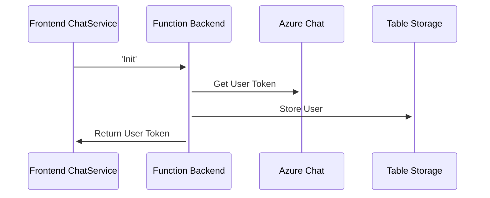

# ChadChatAngular

## Project Overview

This is the front end component that goes with the backend component. Combined these create a very simple chat application. Both of these can be ran together on your machine to give you a simple chat application.

## Project Tech Overview

Project was built using Angualr 15.2.6 and Angular Material. Backend is an Azure Function application.

Frontend makes calls to an Azure function backend for some services. And uses Azure Chat service for sending and receiving messages.

### Development server

Run `ng serve` for a dev server. Navigate to `http://localhost:4200/`. The application will automatically reload if you change any of the source files.

To run this application successfully you will also need to run the backend application.

### Build

Run `ng build` to build the project. The build artifacts will be stored in the `dist/` directory.

## Azure Function Backend

Link: https://github.com/chadmichel/ChadChatBackend

The Azure Function Backend provides a few methods used by this application.

### Backend API

All calls but Init assume Token (azure chat), userId, and userEmail are passed through headers.

```TypeScript
private requestOptions() {
return {
    headers: new HttpHeaders({
    Token: this.token ?? '',
    userId: this.userId ?? '',
    userEmail: this.email ?? '',
    }),
};
}
```

- Init
  - POST /api/Init
- CreateChat
  - POST /api/CreateChat
- GetChats
  - GET /api/GetChats
- LogMessage
  - POST /api/LogMessage

Calls to the backend API are all done in ChatService.ts.

```TypeScript
private httpGet<T>(path: string): Observable<T> {
return this.http.get<T>(
    `${this.getServiceUrl()}/api/${path}?code=${this.getCode()}`,
    this.requestOptions()
);
}

private httpPost<T>(path: string, body: any): Observable<T> {
return this.http.post<T>(
    `${this.getServiceUrl()}/api/${path}?code=${this.getCode()}`,
    body,
    this.requestOptions()
);
}
```

## Chat Sequence Diagrams

1. Init



2. Create Chat

```Mermaid
sequenceDiagram
    Frontend ChatService->>+Function Backend: 'CreateChat'
    Function Backend->>+Azure Chat: Create Chat
    Function Backend->>+Table Storage: Store Chat
    Function Backend->>+Frontend ChatService: Return Chat Id
```

3. Get Chat

```Mermaid
sequenceDiagram
    Frontend ChatService->>+Function Backend: 'GetChats'
    Function Backend->>+Azure Chat: listChatThreads
    Function Backend->>+Table Storage: getChats
    Function Backend->>+Function Backend: filter list
    Function Backend->>+Frontend ChatService: List of chats
```

4. Send and Receive Messages

```Mermaid
sequenceDiagram
    Frontend ChatService->>+Function Backend: LogMessage
    Function Backend->>+BadWords: Clean Message
    BadWords->>+Function Backend: Cleaned Message
    Function Backend->>+Table Storage: Log Message
    Frontend ChatService->>+Azure Chat: sendMessage
```

## Related Blog Post Series

[Part 1 - Angular Setup](https://dontpaniclabs.com/blog/post/2023/04/27/building-a-chat-system-part-1/)

[Part 2 - Azure Chat](https://dontpaniclabs.com/blog/post/2023/05/09/building-a-chat-system-part-2/)
